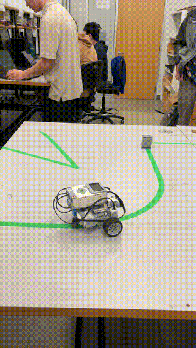
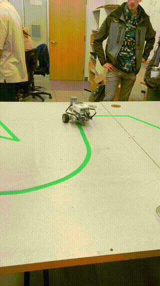
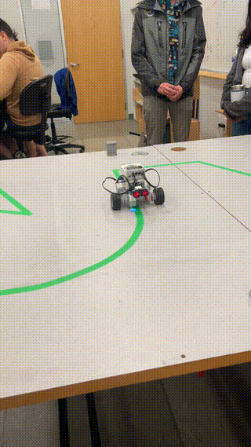

# EV3 Line-Following Robot 🤖

A Python-based autonomous LEGO EV3 robot that follows colored lines using **PID control** and detects obstacles in real-time. 

---

## Demo

---

## Features

- **Autonomous Navigation:** Robot follows colored paths with high accuracy using PID control.
- **Obstacle Detection:** Stops and responds to obstacles using an ultrasonic sensor.
- **PID Control:** Gains (P, I, D) tuned iteratively to achieve smooth and stable path tracking.
- **Sensor Integration:** Uses RGB and ultrasonic sensors for real-time decision-making.

---

## Technologies Used

- **Language:** Python (Pybricks MicroPython)
- **Hardware:** LEGO Mindstorms EV3
- **Libraries:** `pybricks` for motors and sensors
